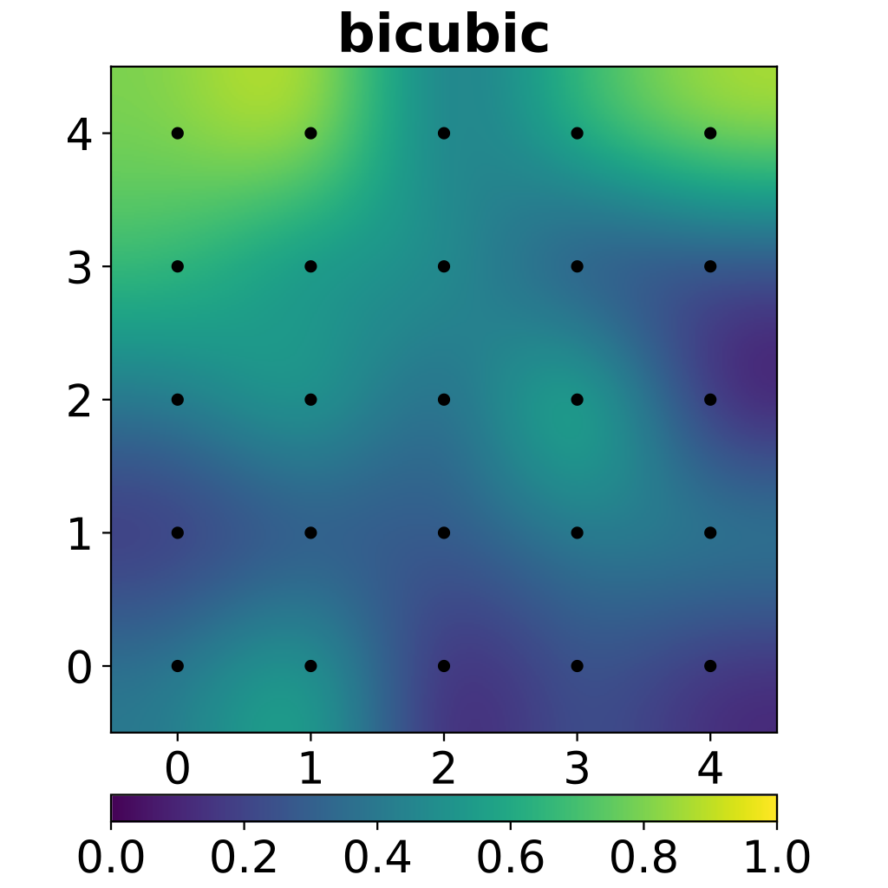

# Bicubic Interpolation

## Introduction

Bicubic interpolation is an extension of cubic interpolation for interpolation data points on a 2D regular grid. The interpolated surface is smoother than corresponding surfaces obtained by bilinear interpolating or nearest-neighbor interpolation.

## Algorithm

Bicubic interpolation is very similar to bilinear interpolation. It can be wiritten as

$$ F(i+v,j+u)=\sum_{row=-1}^{2}{\sum_{col=-1}^{2}{f(i+row,j+col)S(row-v)S(col-u)}} $$

where the bicubic function $S(x)$ is

$$ S(x)=
\begin{cases}
1-(a+3)x^2+(a+2)|x|^3,0\leq|x|\leq1 \\
-4a+8a|x|-5ax^2+a|x|^3,1<|x|\leq2
\end{cases} $$

that $S(0)=1$, $S(n)=0$(when $n$ is an integer or $x$ is out of range).

we can use this function to approximate different spline functions by taking different $a$ value, and we always take $a=-0.5$ or $a=-0.75$.

## Example

