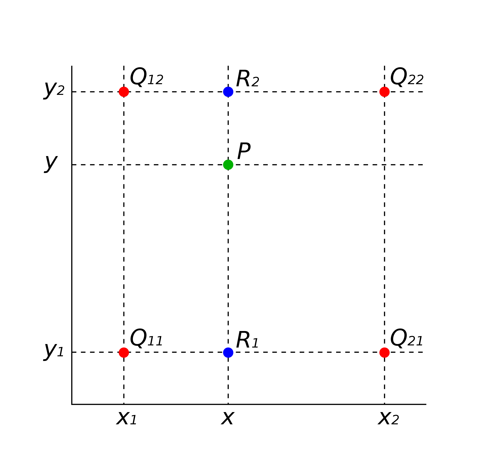
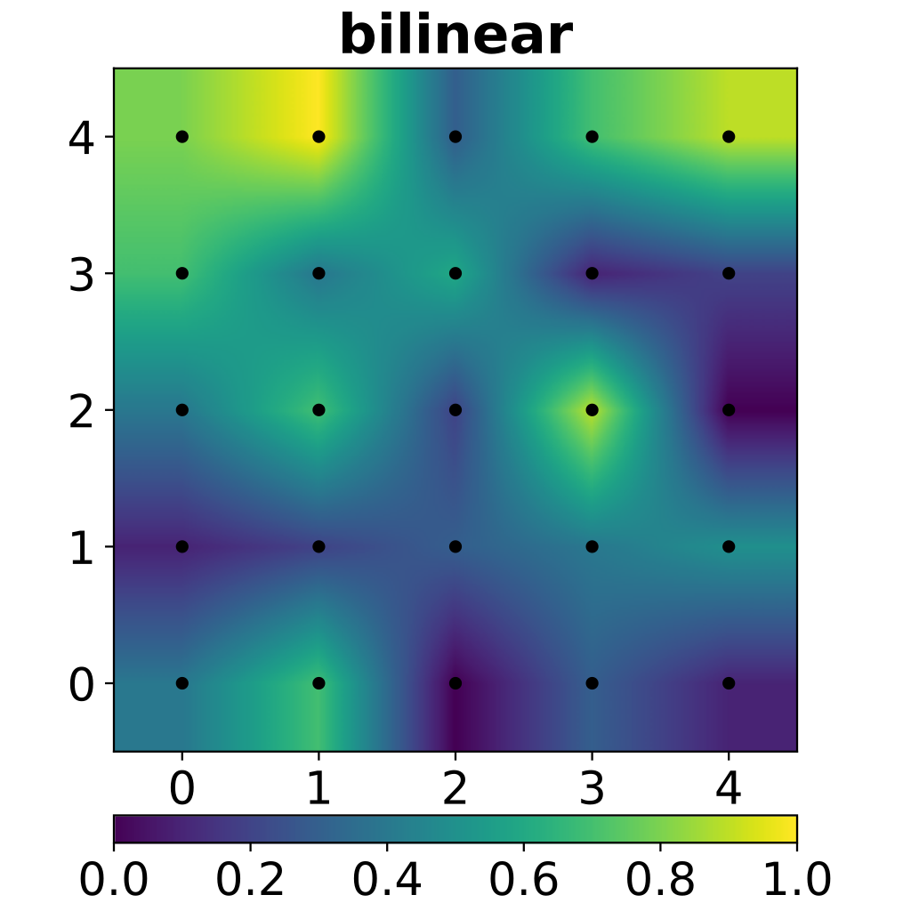

# Bilinear Interpolation

## Introduction

Bilinear interpolation is an extension of linear interpolation for interpolating functions of two variables on a rectilinear 2D grid.

The key idea is to perform linear interpolation first in one direction, and then again in the other direction.

Althouth each step is linear in the sampled values and in the position, the interpolation as a whole is not linear but rather quadratic in the sample location.

## Algorithm

Suppose that we want to find the unknow funcition f at the point (x, y). It is assumed that we know the value of f at the for points $Q_{11}=(x_1,y_1)$, $Q_{12}=(x_1,y_2)$, $Q_{21}=(x_2,y_1)$, and $Q_{22}=(x_2,y_2)$.

1. Do linear interpolation in the x-direction.
   $$ f(x,y_1)\approx\frac{x_2-x}{x_2-x_1}f(Q_{11})+\frac{x-x_1}{x_2-x_1}f(Q_{21}) $$
   $$ f(x,y_2)\approx\frac{x_2-x}{x_2-x_1}f(Q_{12})+\frac{x-x_1}{x_2-x_1}f(Q_{22}) $$
2. Do linear interpolation in the y-direciton.
   $$ f(x,y)\approx\frac{y_2-y}{y_2-y_1}f(x,y_1)+\frac{y-y_1}{y_2-y_1}f(x,y_2) $$
   $$ =\frac{1}{(x_2-x_1)(y_2-y_1)}\left[\begin{matrix}x_2-x&x-x_1\end{matrix}\right]
   \left[\begin{matrix}f(Q_{11})&f(Q_{12}\\f(Q_{21})&f(Q_{22})\end{matrix}\right]
   \left[\begin{matrix}y_2-y\\y-y_1\end{matrix}\right]$$

If we choose a coordinate system in which the for points where f is known are (0,0), (0,1), (1,0), (1,1), then the interpolation formula simplifies to

$$ f(x,y)\approx\left[\begin{matrix}1-x&x\end{matrix}\right]
\left[\begin{matrix}f(0,0)&f(0,1)\\f(1,0)&f(1,1)\end{matrix}\right]
\left[\begin{matrix}1-y\\y\end{matrix}\right] $$

Althouth the bilinear interpolation is the product of two linear functions, it is not linear.

$$ f(x,y)=\sum_{i=0}^{1}{\sum_{j=0}^{1}{a_{ij}x^iy^i}}=a_{00}+a_{10}x+a_{01}y+a_{11}xy $$

where

$$ a_{00}=f(0,0) $$
$$ a_{10}=f(1,0)-f(0,0) $$
$$ a_{01}=f(0,1)-f(0,0) $$
$$ a_{00}=f(1,1)+f(0,0)-(f(1,0)+f(0,1)) $$

## Example

